# roasted

Roast you until you grind finer.

## Overall design

Diagram source: [overall-design.mmd](docs/diagrams/overall-design.mmd).

## Rust crate design

Diagram source: [rust-crate.mmd](docs/diagrams/rust-crate.mmd).

## AI Disclaimer

AI was used to generate all the Gaggimate types (in
`crates/types/src/gaggimate.rs`) based on the
[YAML API definitions](https://github.com/jniebuhr/gaggimate/blob/master/docs/websocket-api.yaml).
This felt much too tedious to do on my own. Some extra types were added after
inspecting the firmware.

All other code is 100% human, organically generated by my brain.
